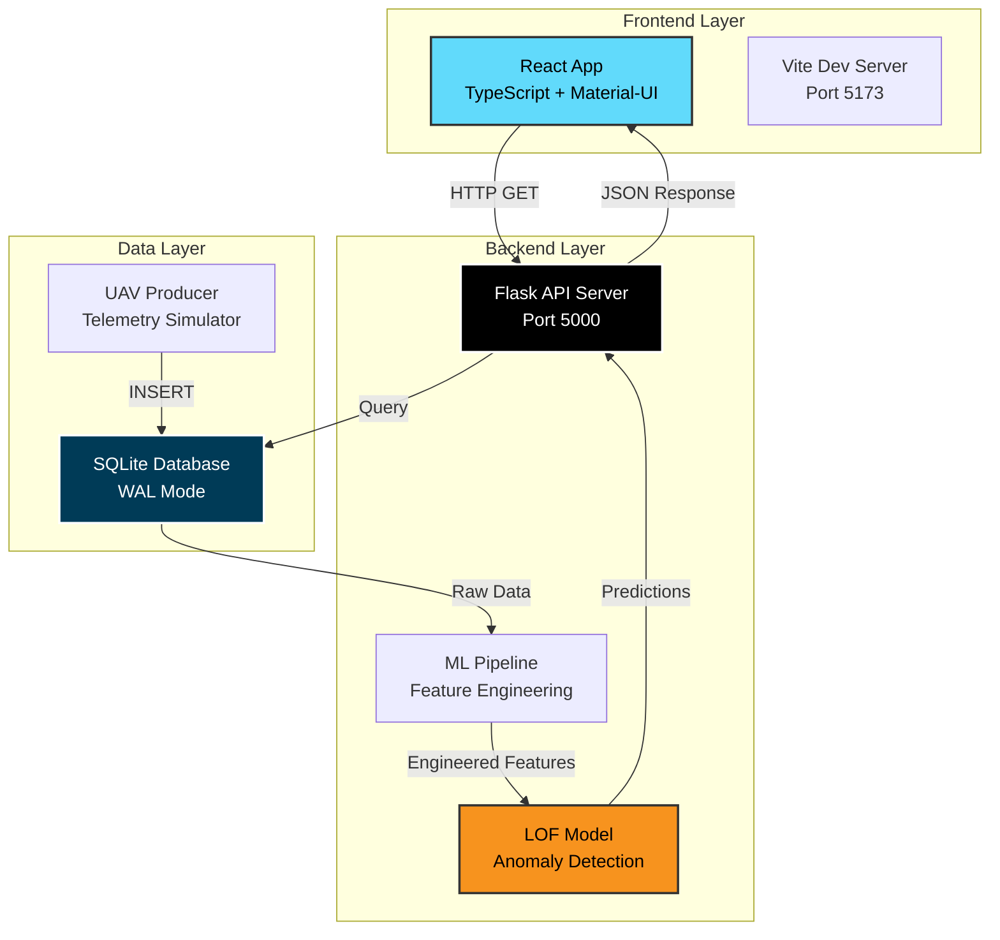

<div align="center">

# 🛰️ PUMA Dashboard
### **P**redictive **U**AV **M**onitoring & **A**nomaly Detection System

[](https://www.python.org/)
[](https://react.dev/)
[](https://www.typescriptlang.org/)
[](https://flask.palletsprojects.com/)
[](https://mui.com/)
[](https://scikit-learn.org/)
[](https://www.sqlite.org/)
[](https://vitejs.dev/)

**Real-time UAV telemetry monitoring with intelligent anomaly detection powered by Machine Learning**

[🚀 Features](#-features) • [🏗️ Architecture](#️-system-architecture) • [📦 Installation](#-installation) • [💻 Usage](#-usage) • [🛠️ Tech Stack](#️-tech-stack) • [📊 Model](#-model-details)

---

</div>

## 📋 Table of Contents

- [🌟 Overview](#-overview)
- [✨ Features](#-features)
- [🏗️ System Architecture](#️-system-architecture)
- [🛠️ Tech Stack](#️-tech-stack)
- [📦 Installation](#-installation)
- [💻 Usage](#-usage)
- [📁 Project Structure](#-project-structure)
- [🔄 Data Pipeline](#-data-pipeline)
- [🎯 Anomaly Detection](#-anomaly-detection)
- [📊 Model Details](#-model-details)
- [💡 Technology Explanation](#-technology-explanation)
- [🎓 Key Design Decisions](#-key-design-decisions)
- [👨‍💻 Developer](#-developer)
- [📄 License](#-license)

---

## 🌟 Overview

**PUMA Dashboard** is a modern, full-stack MLOps platform designed for **real-time monitoring and anomaly detection** in Unmanned Aerial Vehicle (UAV) telemetry data. The system combines cutting-edge web technologies with advanced machine learning algorithms to provide instant insights into UAV health and performance.

### 🎯 Key Objectives

- ⚡ **Real-time Monitoring**: Live visualization of UAV telemetry with 1-second refresh rate
- 🤖 **Predictive Maintenance**: ML-powered early detection of system anomalies
- 📊 **Data-Driven Insights**: Advanced feature engineering for accurate predictions
- 🎨 **Modern UI/UX**: Beautiful, responsive dashboard built with React and Material-UI
- 🔧 **Scalable Architecture**: Modular design with REST API for easy integration

### 🏆 What Makes PUMA Special?

| Feature | Description |
|---------|-------------|
| **🎨 Modern Frontend** | React 18 + TypeScript + Material-UI for a premium user experience |
| **⚡ Real-time Updates** | 1-second refresh rate for instant anomaly detection |
| **🧠 Smart ML Pipeline** | 42 engineered features + LOF algorithm (88.7% ROC-AUC) |
| **📱 Responsive Design** | Works seamlessly on desktop, tablet, and mobile |
| **🔌 RESTful API** | Flask backend with CORS support for easy integration |
| **💾 Concurrent Database** | SQLite with WAL mode for simultaneous read/write |

---

## ✨ Features

### 🎨 **Modern React Dashboard**

<div align="center">

```
┌─────────────────────────────────────────────────────────────┐
│  🔴 System Status  │  ⏰ Timestamp  │  📈 Altitude  │  🔋 Battery  │  ✈️ Mode  │
├─────────────────────────────────────────────────────────────┤
│                                                               │
│  📊 Anomaly Score Timeline                                   │
│  ┌─────────────────────────────────────────────────────┐    │
│  │         ╱╲                                           │    │
│  │        ╱  ╲        ╱╲                               │    │
│  │  ─────╱    ╲──────╱  ╲─────────────────────        │    │
│  └─────────────────────────────────────────────────────┘    │
│                                                               │
│  🚁 Flight Metrics (Altitude & Battery)                      │
│  ┌─────────────────────────────────────────────────────┐    │
│  │  5000m ┤                    ╱‾‾‾╲                   │    │
│  │        │                   ╱     ╲                  │    │
│  │     0m └──────────────────╱       ╲─────────────    │    │
│  └─────────────────────────────────────────────────────┘    │
│                                                               │
│  📋 Recent Telemetry Data                                    │
│  ┌─────────────────────────────────────────────────────┐    │
│  │ Timestamp  │ Status  │ Score  │ Alt  │ Battery │...│    │
│  │ 12:30:45   │ NORMAL  │ 0.23   │ 50m  │ 99.5%   │...│    │
│  │ 12:30:46   │ ANOMALY │ 0.87   │ 51m  │ 99.4%   │...│    │
│  └─────────────────────────────────────────────────────┘    │
└─────────────────────────────────────────────────────────────┘
```

</div>

#### ✅ Dashboard Features:
- **Live Status Cards**: Real-time system health, altitude, battery, timestamp, and flight mode
- **Interactive Charts**: 
  - 📊 Anomaly Score Timeline with configurable history (50-300 points)
  - 🚁 Dual-axis Flight Metrics (Altitude + Battery)
- **Data Table**: Recent telemetry with anomaly highlighting and pagination
- **Auto-refresh**: 1-second update interval for true real-time monitoring
- **Responsive Design**: Adapts to any screen size

### 🤖 **Intelligent Anomaly Detection**

Powered by **Local Outlier Factor (LOF)** algorithm:

| Metric | Value |
|--------|-------|
| 🎯 **ROC-AUC Score** | 88.73% |
| ✅ **Precision** | 84.86% |
| 🔍 **Recall** | 80.09% |
| 📊 **F1-Score** | 82.41% |

#### Detected Anomaly Types:
- ⚙️ **Motor Failure**: Motor RPM drops to 0, temperature spikes to 150°C
- 📡 **Sensor Glitch**: Altitude sensor reports +50-150m error
- 🔋 **Battery Drop**: Sudden 10-20% capacity loss

### 🔌 **RESTful API Backend**

Flask-powered API with the following endpoints:

```http
GET /telemetry/latest?history_limit=150
GET /status
GET /telemetry/anomalies
GET /api/telemetry
GET /api/stats
GET /api/health
```

**Features**:
- ✅ CORS enabled for cross-origin requests
- ✅ Real-time anomaly prediction
- ✅ Detailed error logging with stack traces
- ✅ Read-only database connections for safety

---

## 🏗️ System Architecture

<div align="center">



</div>

### 📡 Data Flow

1. **UAV Producer** (`uav_producer.py`) generates real-time telemetry → SQLite DB
2. **Flask API** (`api_server.py`) queries database → Feature engineering → ML prediction
3. **React Frontend** polls API every 1 second → Updates UI components
4. **User** views real-time dashboard with anomaly alerts

---

## 🛠️ Tech Stack

### 🎨 **Frontend Stack**

| Technology | Version | Purpose |
|------------|---------|---------|
|  | 18.3.1 | UI Framework |
|  | 5.6.2 | Type Safety |
|  | 6.1.8 | Component Library |
|  | 4.4.7 | Data Visualization |
|  | 1.7.9 | HTTP Client |
|  | 5.4.11 | Build Tool |

**Frontend Dependencies**:
```json
{
  "react": "^18.3.1",
  "react-dom": "^18.3.1",
  "@mui/material": "^6.1.8",
  "@emotion/react": "^11.14.0",
  "@emotion/styled": "^11.14.0",
  "chart.js": "^4.4.7",
  "react-chartjs-2": "^5.3.0",
  "axios": "^1.7.9"
}
```

### ⚙️ **Backend Stack**

| Technology | Version | Purpose |
|------------|---------|---------|
|  | 3.8+ | Core Language |
|  | 3.0+ | Web Framework |
|  | 5.0+ | CORS Handling |
|  | 1.3+ | Machine Learning |
|  | 2.0+ | Data Manipulation |
|  | 1.24+ | Numerical Computing |
|  | 3 | Database |

**Backend Dependencies** (`requirements.txt`):
```
flask>=3.0.0
flask-cors>=5.0.0
pandas>=2.0.0
numpy>=1.24.0
scikit-learn>=1.3.0
joblib>=1.3.0
```

### 🗂️ **Database**

- **SQLite 3** with **WAL (Write-Ahead Logging)** mode
- Enables concurrent reads/writes
- No "database is locked" errors
- Perfect for embedded systems

---

## 📦 Installation

### Prerequisites

- **Node.js** 18+ and **npm** 9+
- **Python** 3.8+
- **Git** (optional)

### Step-by-Step Setup

#### 1️⃣ Clone the Repository

```bash
git clone https://github.com/suryahanjaya/puma.git
cd puma
```

#### 2️⃣ Backend Setup (Python)

```bash
# Create virtual environment
python -m venv venv

# Activate virtual environment
# Windows:
venv\Scripts\activate
# Linux/Mac:
source venv/bin/activate

# Install Python dependencies
pip install -r requirements.txt
```

#### 3️⃣ Frontend Setup (React)

```bash
cd frontend

# Install Node.js dependencies
npm install

# Return to root directory
cd ..
```

#### 4️⃣ Verify Installation

```bash
# Check Python packages
python -c "import flask, sklearn, pandas; print('✅ Backend ready!')"

# Check Node.js packages
cd frontend && npm list react && cd ..
```

---

## 💻 Usage

### 🚀 Quick Start (3 Terminals)

#### Terminal 1: Start UAV Producer

```bash
python src/uav_producer.py
```

**Expected Output**:
```
🚁 UAV Telemetry Producer dimulai...
==================================================
Database target: data\uav_telemetry.db
CSV sumber: data\telemetry_data.csv
✓ Ditemukan 45 kolom dari CSV
✓ Tabel 'telemetry' berhasil dibuat/diverifikasi
✓ Mode WAL (Write-Ahead Logging) diaktifkan
✈️  Memulai Misi: Target 5000m, Cruise 150 detik. Fase Awal: CLIMB

🔄 Memulai loop produser (Ctrl+C untuk berhenti)...
[2025/12/04 12:30:01] ✓ Fase: CLIMB | Alt: 30.5m | Battery: 99.9% | Status: Normal
[2025/12/04 12:30:02] ✓ Fase: CLIMB | Alt: 60.2m | Battery: 99.8% | Status: Normal
```

#### Terminal 2: Start Flask API Server

```bash
python api_server.py
```

**Expected Output**:
```
Loading ML assets...
✓ Loaded model with 42 features
🚀 Starting PUMA Dashboard API Server...
📊 Dashboard: http://localhost:5000
🔌 API Endpoints:
   - GET /telemetry/latest?history_limit=150
   - GET /status
   - GET /telemetry/anomalies
   - GET /api/telemetry
   - GET /api/stats
   - GET /api/health
 * Running on http://0.0.0.0:5000
```

#### Terminal 3: Start React Frontend

```bash
cd frontend
npm run dev
```

**Expected Output**:
```
  VITE v5.4.11  ready in 523 ms

  ➜  Local:   http://localhost:5173/
  ➜  Network: http://192.168.1.100:5173/
  ➜  press h + enter to show help
```

#### 4️⃣ Access the Dashboard

Open your browser and navigate to: **http://localhost:5173**

---

## 📁 Project Structure

```
puma/
│
├── 📄 api_server.py                    # Flask REST API backend
├── 📄 requirements.txt                 # Python dependencies
├── 📄 README.md                        # This file
│
├── 📂 frontend/                        # React frontend application
│   ├── 📄 package.json                # Node.js dependencies
│   ├── 📄 vite.config.ts              # Vite configuration
│   ├── 📄 tsconfig.json               # TypeScript configuration
│   ├── 📄 index.html                  # HTML entry point
│   │
│   └── 📂 src/                        # Source code
│       ├── 📄 main.tsx                # React entry point
│       ├── 📄 App.tsx                 # Main application component
│       ├── 📄 App.css                 # Global styles
│       │
│       ├── 📂 components/             # React components
│       │   ├── Header.tsx             # Dashboard header
│       │   ├── StatusCard.tsx         # Status metric cards
│       │   ├── AnomalyChart.tsx       # Anomaly score chart
│       │   ├── MetricsChart.tsx       # Flight metrics chart
│       │   └── TelemetryTable.tsx     # Data table
│       │
│       ├── 📂 services/               # API services
│       │   └── api.ts                 # Axios HTTP client
│       │
│       ├── 📂 types/                  # TypeScript types
│       │   └── uav.ts                 # UAV data interfaces
│       │
│       ├── 📂 theme/                  # UI theme
│       │   └── theme.ts               # Material-UI theme config
│       │
│       └── 📂 utils/                  # Utility functions
│           └── helpers.ts             # Helper functions
│
├── 📂 data/                            # Data storage
│   ├── uav_telemetry.db               # SQLite database (runtime)
│   ├── telemetry_data.csv             # Training dataset
│   └── feature_names.json             # ML feature list
│
├── 📂 models/                          # Trained ML models
│   ├── lof_novelty.joblib             # LOF anomaly detector
│   ├── data_scaler.joblib             # StandardScaler
│   ├── isolation_forest.joblib        # Alternative model
│   └── eval_artifacts.joblib          # Evaluation metrics
│
├── 📂 src/                             # Backend source code
│   ├── uav_producer.py                # Telemetry data simulator
│   ├── generate_dummy_data.py         # Training data generator
│   └── train_model_adaptive.ipynb     # Model training notebook
│
└── 📂 venv/                            # Python virtual environment
```

---

## 🔄 Data Pipeline

### 📊 Feature Engineering Pipeline

The system transforms **36 raw telemetry features** into **42 engineered features**:

```python
# Raw Features (36)
raw_features = [
    # Position & Navigation
    'altitude', 'gps_alt', 'lidar_altitude',
    'gps_lat', 'gps_lon',
    'heading', 'pitch', 'roll', 'yaw',
    
    # Flight Dynamics
    'ground_speed', 'airspeed', 'vertical_speed',
    'throttle_position', 'payload_weight',
    
    # IMU Sensors
    'accel_x', 'accel_y', 'accel_z',
    'gyro_x', 'gyro_y', 'gyro_z',
    
    # Motor System
    'motor_rpm_1', 'motor_rpm_2', 'motor_rpm_3', 'motor_rpm_4',
    'motor_temp_1', 'motor_temp_2', 'motor_temp_3', 'motor_temp_4',
    
    # Power System
    'battery_level', 'battery_voltage', 'battery_current',
    'temperature_battery',
    
    # Communication
    'sat_count', 'gps_fix_type',
    'link_quality', 'signal_strength',
    'obstacle_distance'
]

# Engineered Features (6)
engineered_features = [
    'motor_rpm_std',           # Motor imbalance detection
    'motor_rpm_mean',          # Average motor speed
    'motor_temp_std',          # Motor temperature variance
    'alt_disagreement_std',    # Sensor conflict detection
    'power_draw',              # Battery voltage × current
    'roll_accel_z_std',        # Vertical vibration (5-window rolling)
    'roll_gyro_x_std'          # Pitch rate variance (5-window rolling)
]

# Total: 42 features
```

### 🔧 Feature Engineering Code

```python
def feature_engineering(df):
    """
    Creates 6 engineered features from raw telemetry.
    MUST match training pipeline exactly!
    """
    df_eng = df.copy()
    
    # 1. Motor Aggregations
    motor_rpm_cols = ['motor_rpm_1', 'motor_rpm_2', 'motor_rpm_3', 'motor_rpm_4']
    df_eng['motor_rpm_std'] = df_eng[motor_rpm_cols].std(axis=1)
    df_eng['motor_rpm_mean'] = df_eng[motor_rpm_cols].mean(axis=1)
    
    motor_temp_cols = ['motor_temp_1', 'motor_temp_2', 'motor_temp_3', 'motor_temp_4']
    df_eng['motor_temp_std'] = df_eng[motor_temp_cols].std(axis=1)
    
    # 2. Sensor Disagreement
    alt_cols = ['altitude', 'gps_alt', 'lidar_altitude']
    df_eng['alt_disagreement_std'] = df_eng[alt_cols].std(axis=1)
    
    # 3. Power System
    df_eng['power_draw'] = df_eng['battery_voltage'] * df_eng['battery_current']
    
    # 4. Rolling Statistics (requires sorted data)
    df_eng = df_eng.sort_values(by='timestamp', ascending=True)
    df_eng['roll_accel_z_std'] = df_eng['accel_z'].rolling(window=5, min_periods=1).std()
    df_eng['roll_gyro_x_std'] = df_eng['gyro_x'].rolling(window=5, min_periods=1).std()
    
    return df_eng.fillna(0)
```

---

## 🎯 Anomaly Detection

### 🧠 Local Outlier Factor (LOF) Algorithm

LOF is an **unsupervised** anomaly detection algorithm that identifies outliers by measuring the **local density deviation** of a data point with respect to its neighbors.

#### How LOF Works

```
1. For each data point:
   ├─ Find K=20 nearest neighbors
   ├─ Calculate local reachability density
   ├─ Compare density to neighbors' densities
   └─ Compute LOF score

2. LOF Score Interpretation:
   ├─ LOF ≈ 1.0  → Normal (similar density to neighbors)
   ├─ LOF > 1.0  → Outlier (lower density than neighbors)
   └─ LOF >> 1.0 → Strong anomaly
```

#### Model Configuration

```python
from sklearn.neighbors import LocalOutlierFactor

lof = LocalOutlierFactor(
    n_neighbors=20,        # Number of neighbors to consider
    contamination=0.2,     # Expected 20% anomalies in training data
    novelty=True,          # Enable prediction on new data
    metric='euclidean',    # Distance metric
    algorithm='auto'       # Automatic algorithm selection
)

# Training
lof.fit(X_train_scaled)

# Prediction
predictions = lof.predict(X_new)        # 1 = normal, -1 = anomaly
scores = -lof.decision_function(X_new)  # Higher = more anomalous
```

### 💣 Anomaly Injection Strategy

The UAV producer simulates **3 types of realistic anomalies** during flight:

| Anomaly Type | Probability | Trigger Condition | Effect |
|--------------|-------------|-------------------|--------|
| **Motor Failure** | 40% | Random motor (1-4) | RPM → 0, Temp → 150°C |
| **Sensor Glitch** | 40% | Altitude sensor | Altitude +50 to +150m |
| **Battery Drop** | 20% | Sudden discharge | Battery -10% to -20% |

**Code Implementation**:

```python
# 5% chance of anomaly per second during flight
if state["phase"] != "LANDED" and random.random() < 0.05:
    
    # Weighted random selection
    anomaly_type = random.choice([
        "motor_fail", "sensor_glitch",  # 40% each
        "motor_fail", "sensor_glitch",
        "battery_drop"                   # 20%
    ])
    
    if anomaly_type == "motor_fail":
        motor_num = random.randint(1, 4)
        new_data[f"motor_rpm_{motor_num}"] = 0
        new_data[f"motor_temp_{motor_num}"] = 150.0
        new_data["event"] = f"Motor {motor_num} Failure"
        new_data["system_status"] = "Error"
    
    elif anomaly_type == "sensor_glitch":
        new_data["altitude"] += random.uniform(50, 150)
        new_data["event"] = "Altitude Sensor Glitch"
        new_data["system_status"] = "Error"
    
    elif anomaly_type == "battery_drop":
        new_data["battery_level"] -= random.uniform(10, 20)
        new_data["event"] = "Sudden Battery Drop"
        new_data["system_status"] = "Warning"
```

---

## 📊 Model Details

### 📈 Training Dataset

- **Total Samples**: 17,970
- **Features**: 42 (36 raw + 6 engineered)
- **Anomaly Ratio**: 20.02%
- **Training Date**: 2025-11-11
- **Train/Test Split**: 65% / 35% (stratified)

### 🎯 Performance Metrics

#### LOF Model (Selected)

| Metric | Score | Interpretation |
|--------|-------|----------------|
| **ROC-AUC** | 88.73% | Excellent discrimination ability |
| **Precision** | 84.86% | 85% of predicted anomalies are true anomalies |
| **Recall** | 80.09% | Detects 80% of all actual anomalies |
| **F1-Score** | 82.41% | Good balance of precision and recall |

**Confusion Matrix**:
```
                Predicted
              Normal  Anomaly
Actual Normal   2361     514    (82.1% specificity)
      Anomaly    716    2881    (80.1% recall)
```

#### Model Comparison

| Model | ROC-AUC | Precision | Recall | F1-Score | Selected? |
|-------|---------|-----------|--------|----------|-----------|
| **LOF** | **88.73%** | **84.86%** | **80.09%** | **82.41%** | ✅ **Yes** |
| Isolation Forest | 65.03% | 57.65% | 96.83% | 72.27% | ❌ No |
| Ensemble | 70.94% | 60.76% | 91.58% | 73.05% | ❌ No |

**Winner**: LOF provides the best **precision-recall balance**, minimizing false positives in critical UAV systems.

---

## 💡 Technology Explanation

### 🎨 **Why React + TypeScript?**

**React 18** is the most popular UI library for building modern web applications:

- ✅ **Component-Based**: Reusable UI components (StatusCard, AnomalyChart, etc.)
- ✅ **Virtual DOM**: Fast re-rendering for real-time updates
- ✅ **Hooks**: `useState`, `useEffect` for state management and side effects
- ✅ **Ecosystem**: Huge library ecosystem (Material-UI, Chart.js, Axios)

**TypeScript** adds type safety:

```typescript
// Type-safe API response
interface UAVTelemetry {
    timestamp: number;
    dt: string;
    altitude: number;
    battery_level: number;
    is_anomaly: boolean;
    anomaly_score: number;
}

// Compile-time error if wrong type
const data: UAVTelemetry = {
    timestamp: "wrong type",  // ❌ Error: Type 'string' is not assignable to type 'number'
    // ...
};
```

### 🎨 **Why Material-UI (MUI)?**

Material-UI is Google's design system for React:

- ✅ **Pre-built Components**: Cards, Tables, Charts, Buttons, etc.
- ✅ **Theming**: Customizable color schemes and typography
- ✅ **Responsive**: Mobile-first design out of the box
- ✅ **Accessibility**: ARIA labels and keyboard navigation

**Example**:

```tsx
<Card>
  <CardContent>
    <Typography variant="h5">System Status</Typography>
    <Typography variant="h4" color="primary">NORMAL</Typography>
  </CardContent>
</Card>
```

### ⚡ **Why Vite?**

Vite is a next-generation build tool:

- ✅ **Instant Server Start**: No bundling in dev mode
- ✅ **Lightning Fast HMR**: Hot Module Replacement in <50ms
- ✅ **Optimized Build**: Rollup-based production builds
- ✅ **TypeScript Support**: Built-in TypeScript compilation

**Speed Comparison**:
```
Webpack: 10-30 seconds startup
Vite:    0.5-2 seconds startup  ⚡ 10-60x faster!
```

### 🔌 **Why Flask?**

Flask is a lightweight Python web framework:

- ✅ **Minimalist**: Only what you need, no bloat
- ✅ **Flexible**: Easy to add extensions (Flask-CORS)
- ✅ **Python Ecosystem**: Direct access to scikit-learn, pandas, numpy
- ✅ **RESTful**: Perfect for building JSON APIs

**Example**:

```python
@app.route('/telemetry/latest')
def get_latest_telemetry():
    # Query database
    df = pd.read_sql_query("SELECT * FROM telemetry LIMIT 150", conn)
    
    # Predict anomalies
    df_results = predict_anomalies(df)
    
    # Return JSON
    return jsonify({
        'latest': df_results.iloc[0].to_dict(),
        'history': df_results.to_dict('records')
    })
```

### 📊 **Why Chart.js?**

Chart.js is a powerful charting library:

- ✅ **Interactive**: Hover tooltips, zoom, pan
- ✅ **Responsive**: Adapts to container size
- ✅ **Customizable**: Full control over colors, labels, axes
- ✅ **Performance**: Handles 1000+ data points smoothly

**Example**:

```tsx
<Line
  data={{
    labels: data.map(d => new Date(d.dt).toLocaleTimeString()),
    datasets: [{
      label: 'Anomaly Score',
      data: data.map(d => d.anomaly_score),
      borderColor: '#DC143C',
      fill: true
    }]
  }}
/>
```

### 💾 **Why SQLite with WAL Mode?**

SQLite is a serverless, embedded database:

- ✅ **Zero Configuration**: No server setup required
- ✅ **Single File**: Entire database in one `.db` file
- ✅ **ACID Compliant**: Reliable transactions
- ✅ **WAL Mode**: Write-Ahead Logging enables concurrent reads/writes

**WAL Mode Benefits**:

```python
# Enable WAL mode
cursor.execute("PRAGMA journal_mode=WAL;")

# Now:
# - Producer can INSERT while API reads
# - No "database is locked" errors
# - Better performance (writes don't block reads)
```

---

## 🎓 Key Design Decisions

### 1️⃣ **Why LOF over Isolation Forest?**

| Metric | LOF | Isolation Forest |
|--------|-----|------------------|
| Precision | 84.86% | 57.65% |
| Recall | 80.09% | 96.83% |
| **Decision** | ✅ **Selected** | ❌ Rejected |

**Reason**: In UAV systems, **false positives are costly** (unnecessary emergency landings). LOF's higher precision (84.86%) minimizes false alarms while still detecting 80% of anomalies.

### 2️⃣ **Why 1-Second Refresh Rate?**

```typescript
useEffect(() => {
  const interval = setInterval(() => {
    fetchData();
  }, 1000);  // 1 second = 1000ms
  
  return () => clearInterval(interval);
}, []);
```

**Reasoning**:
- ✅ **Real-time Feel**: Matches UAV telemetry update rate (1 Hz)
- ✅ **Smooth Charts**: Animations look fluid
- ✅ **Low Overhead**: API response time ~50-100ms, plenty of headroom
- ❌ **Not 100ms**: Would overload server with 10 requests/second

### 3️⃣ **Why Feature Engineering?**

Raw sensors alone miss complex patterns:

| Feature | Detects |
|---------|---------|
| `motor_rpm_std` | Motor imbalance (one motor failing) |
| `alt_disagreement_std` | Sensor conflicts (GPS vs barometer vs lidar) |
| `power_draw` | Power system issues (voltage drop under load) |
| `roll_accel_z_std` | Vibration trends (bearing wear, propeller damage) |

**Example**: A motor failure might not show in individual RPM values, but `motor_rpm_std` will spike dramatically.

### 4️⃣ **Why TypeScript over JavaScript?**

```typescript
// TypeScript catches errors at compile-time
function fetchData(limit: number): Promise<UAVTelemetry[]> {
  return api.get('/telemetry/latest', { params: { limit } });
}

fetchData("150");  // ❌ Error: Argument of type 'string' is not assignable to parameter of type 'number'

// JavaScript only fails at runtime
function fetchData(limit) {
  return api.get('/telemetry/latest', { params: { limit } });
}

fetchData("150");  // ✅ No error, but API might fail!
```

**Benefits**:
- ✅ **Early Error Detection**: Catch bugs before deployment
- ✅ **Better IDE Support**: Autocomplete, refactoring, go-to-definition
- ✅ **Self-Documenting**: Types serve as inline documentation

### 5️⃣ **Why Material-UI Theme?**

```typescript
// Centralized theme configuration
const theme = createTheme({
  palette: {
    primary: { main: '#DC143C' },      // PUMA Red
    secondary: { main: '#FFD700' },    // Gold accent
  },
  typography: {
    fontFamily: '"Inter", "Roboto", sans-serif',
  }
});

// Consistent styling across all components
<Button color="primary">Click Me</Button>
<Typography color="primary">ANOMALY</Typography>
```

**Benefits**:
- ✅ **Consistency**: Same colors/fonts everywhere
- ✅ **Easy Updates**: Change theme once, updates everywhere
- ✅ **Responsive**: Breakpoints handled automatically

---

## 👨‍💻 Developer

<div align="center">

### **Surya Hanjaya**

[](https://www.linkedin.com/in/surya-hanjaya/)
[](https://github.com/suryahanjaya)
[](https://www.instagram.com/h4njy/)

**Full-Stack Developer | Machine Learning Engineer | UAV Enthusiast**

*Passionate about building intelligent systems that make autonomous vehicles safer and more reliable.*

</div>

---

## 📄 License

This project is licensed under the **MIT License**:

```
MIT License

Copyright (c) 2025 Surya Hanjaya

Permission is hereby granted, free of charge, to any person obtaining a copy
of this software and associated documentation files (the "Software"), to deal
in the Software without restriction, including without limitation the rights
to use, copy, modify, merge, publish, distribute, sublicense, and/or sell
copies of the Software, and to permit persons to whom the Software is
furnished to do so, subject to the following conditions:

The above copyright notice and this permission notice shall be included in all
copies or substantial portions of the Software.

THE SOFTWARE IS PROVIDED "AS IS", WITHOUT WARRANTY OF ANY KIND, EXPRESS OR
IMPLIED, INCLUDING BUT NOT LIMITED TO THE WARRANTIES OF MERCHANTABILITY,
FITNESS FOR A PARTICULAR PURPOSE AND NONINFRINGEMENT. IN NO EVENT SHALL THE
AUTHORS OR COPYRIGHT HOLDERS BE LIABLE FOR ANY CLAIM, DAMAGES OR OTHER
LIABILITY, WHETHER IN AN ACTION OF CONTRACT, TORT OR OTHERWISE, ARISING FROM,
OUT OF OR IN CONNECTION WITH THE SOFTWARE OR THE USE OR OTHER DEALINGS IN THE
SOFTWARE.
```

---

<div align="center">

### ⭐ Star this repo if you find it useful!

**Made with ❤️ by Surya Hanjaya**

🇮🇩 **Indonesia** | 🛰️ **UAV Technology** | 🤖 **Machine Learning**

</div>
