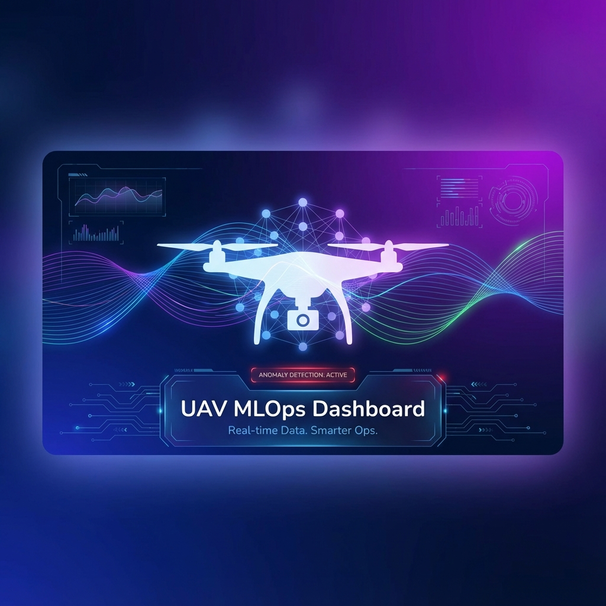
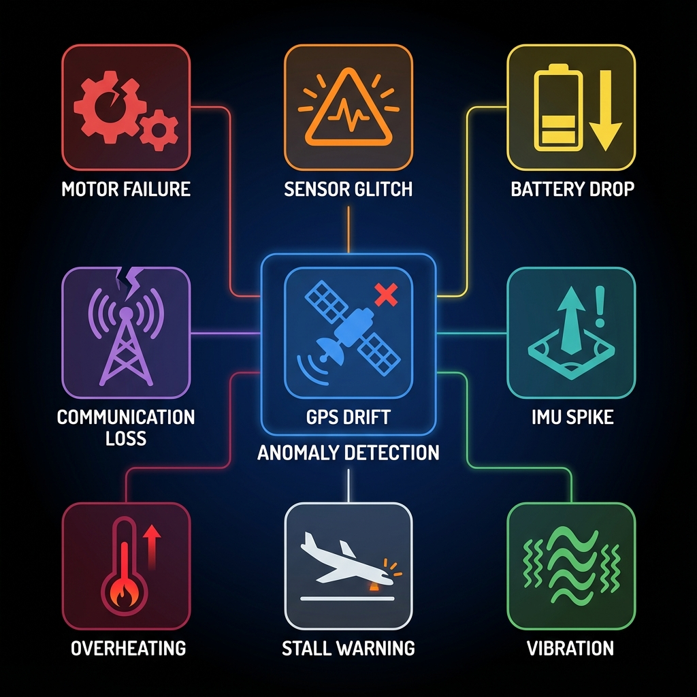
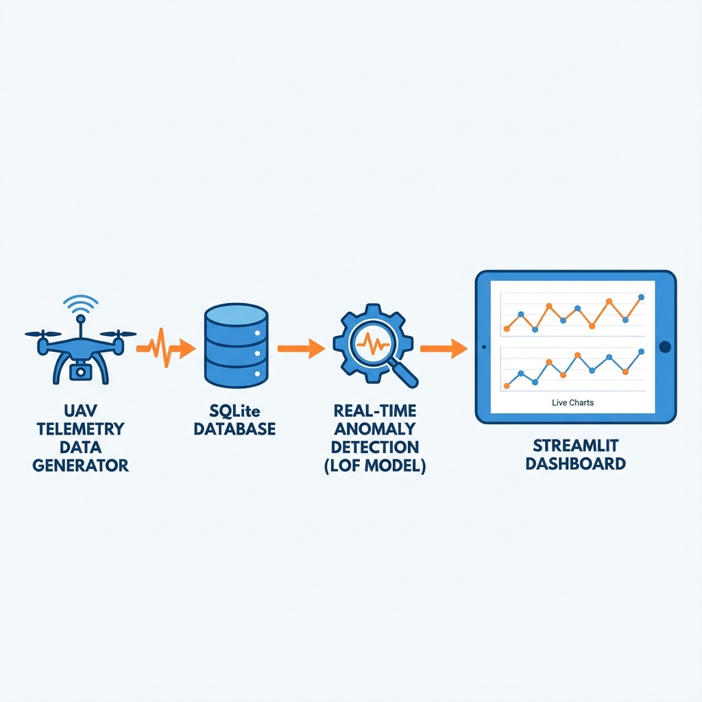
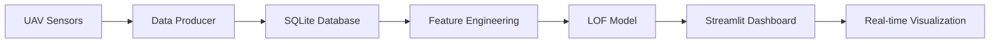
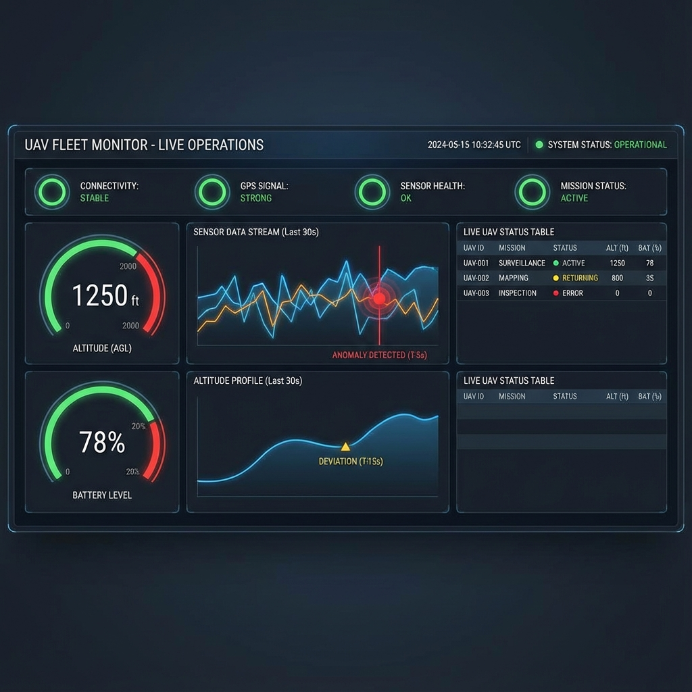
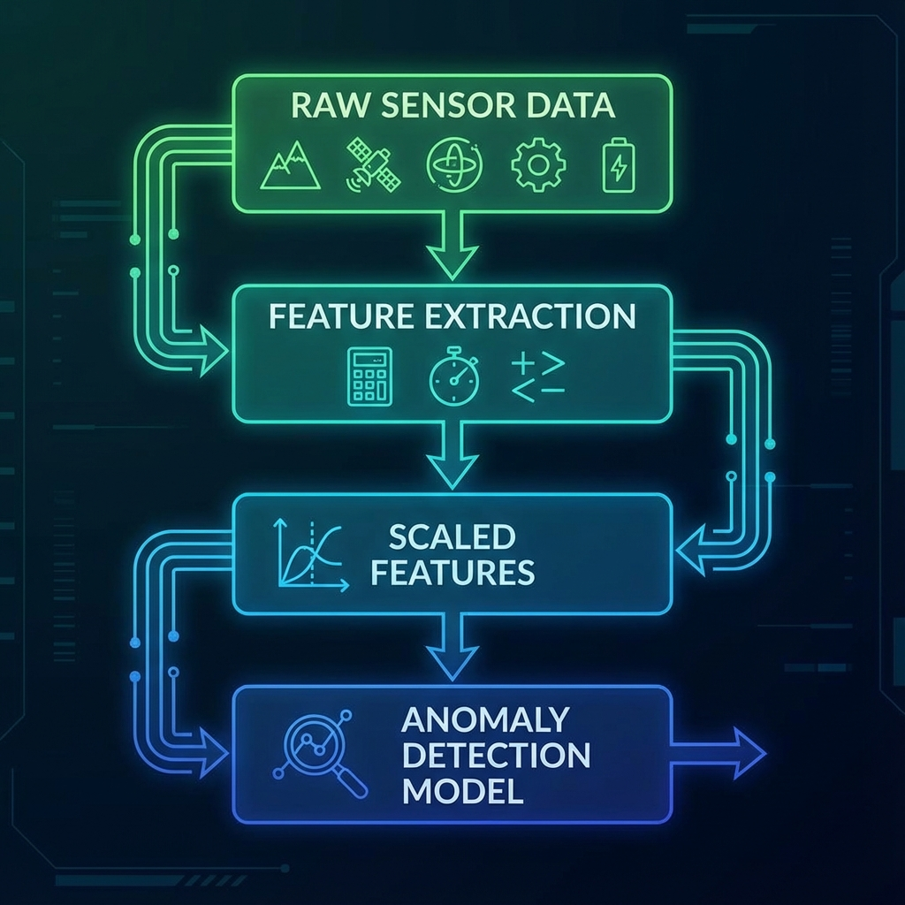

<div align="center">



# 🛰️ PUMA - UAV MLOps Dashboard
### **P**redictive **U**AV **M**onitoring & **A**nomaly Detection System

[](https://www.python.org/)
[](https://streamlit.io/)
[](https://scikit-learn.org/)
[](https://www.sqlite.org/)
[](https://plotly.com/)

**Real-time UAV telemetry monitoring with intelligent anomaly detection using Machine Learning**

[Features](#-features) • [Architecture](#-system-architecture) • [Installation](#-installation) • [Usage](#-usage) • [Tech Stack](#-tech-stack)

---

</div>

## 📋 Table of Contents

- [Overview](#-overview)
- [Features](#-features)
- [System Architecture](#-system-architecture)
- [Tech Stack](#-tech-stack)
- [Installation](#-installation)
- [Usage](#-usage)
- [Project Structure](#-project-structure)
- [Data Pipeline](#-data-pipeline)
- [Anomaly Detection](#-anomaly-detection)
- [Model Details](#-model-details)
- [Code Explanation](#-code-explanation)
- [Developer](#-developer)
- [License](#-license)

---

## 🌟 Overview

**PUMA** is a comprehensive MLOps dashboard designed for real-time monitoring and anomaly detection in Unmanned Aerial Vehicle (UAV) telemetry data. The system leverages machine learning algorithms to identify abnormal flight patterns, sensor failures, and potential system malfunctions before they become critical.

### 🎯 Key Objectives

- **Real-time Monitoring**: Live visualization of UAV telemetry data
- **Predictive Maintenance**: Early detection of system anomalies
- **Data-Driven Insights**: Advanced feature engineering for accurate predictions
- **Scalable Architecture**: Modular design for easy extension and deployment

---

## ✨ Features

### 🔴 Real-Time Dashboard
- **Live Status Monitoring**: Instant updates on system health, altitude, battery, and flight mode
- **Interactive Visualizations**: Dynamic charts using Plotly for anomaly scores and flight metrics
- **Configurable History**: Adjustable data window (50-5000 data points)

### 🤖 Intelligent Anomaly Detection
- **Local Outlier Factor (LOF)**: Advanced unsupervised learning algorithm
- **Multi-Feature Analysis**: Monitors 42+ engineered features
- **Real-time Scoring**: Continuous anomaly probability calculation
- **9 Anomaly Types Detected**:
  - ⚙️ Motor Failure
  - 📡 Sensor Glitch
  - 🔋 Battery Drop
  - 📶 Communication Loss
  - 🛰️ GPS Drift
  - 📊 IMU Spike
  - 🌡️ Overheating
  - ⚠️ Stall Warning
  - 🔊 High Vibration



### 📊 Advanced Data Pipeline
- **Automated Data Generation**: Realistic UAV flight simulation
- **Feature Engineering**: 42 derived features from raw telemetry
- **Database Integration**: SQLite with WAL mode for concurrent access
- **Historical Analysis**: Support for batch data processing

---

## 🏗️ System Architecture



### Data Flow



### Components

1. **Data Producer** (`uav_producer.py`)
   - Simulates real-time UAV telemetry
   - Implements flight phases: CLIMB → CRUISE → DESCEND → LANDED
   - Injects realistic anomalies (20% of data)

2. **Feature Engineering Pipeline**
   - Motor aggregations (RPM std/mean, temp std)
   - Sensor disagreement metrics
   - Power system calculations
   - Rolling statistics (5-window)

3. **Anomaly Detection Model**
   - Local Outlier Factor (LOF) with novelty detection
   - Trained on 17,970 samples
   - 88.7% ROC-AUC score
   - 84.9% precision, 80.1% recall

4. **Dashboard** (`app.py`)
   - Streamlit-based web interface
   - Real-time data refresh (1.5s interval)
   - Interactive Plotly charts
   - Configurable data window

---

## 🛠️ Tech Stack

### Core Technologies

| Technology | Purpose | Version |
|------------|---------|---------|
|  | Core Language | 3.8+ |
|  | Dashboard Framework | Latest |
|  | Machine Learning | Latest |
|  | Data Manipulation | Latest |
|  | Numerical Computing | Latest |
|  | Interactive Visualization | Latest |
|  | Database | 3 |

### Python Libraries

```python
pandas          # Data manipulation and analysis
numpy           # Numerical computing
scikit-learn    # Machine learning (LOF, StandardScaler)
joblib          # Model serialization
streamlit       # Web dashboard framework
plotly          # Interactive visualizations
sqlite3         # Database operations
```

---

## 📦 Installation

### Prerequisites

- Python 3.8 or higher
- pip package manager
- Git (optional)

### Step-by-Step Setup

1. **Clone or Download the Repository**
   ```bash
   git clone https://github.com/suryahanjaya/uav-mlops-dashboard.git
   cd uav-mlops-dashboard
   ```

2. **Create Virtual Environment** (Recommended)
   ```bash
   python -m venv venv
   
   # Windows
   venv\Scripts\activate
   
   # Linux/Mac
   source venv/bin/activate
   ```

3. **Install Dependencies**
   ```bash
   pip install -r requirements.txt
   ```

4. **Verify Installation**
   ```bash
   python -c "import streamlit; import sklearn; import plotly; print('✅ All dependencies installed!')"
   ```

---

## 🚀 Usage

### Quick Start

#### 1. Start the Data Producer

Open a terminal and run:

```bash
python src/uav_producer.py
```

**Expected Output:**
```
🚁 UAV Telemetry Producer dimulai...
==================================================
Database target: data/uav_telemetry.db
✓ Mode WAL (Write-Ahead Logging) diaktifkan
✈️  Memulai Misi: Target 5000m, Cruise 150 detik
🔄 Memulai loop produser (Ctrl+C untuk berhenti)...
[2025/12/03 16:14:05] ✓ Fase: CLIMB | Alt: 30.5m | Battery: 99.9% | Status: Normal
```

#### 2. Launch the Dashboard

Open a **second terminal** and run:

```bash
streamlit run app.py
```

**Expected Output:**
```
You can now view your Streamlit app in your browser.

  Local URL: http://localhost:8501
  Network URL: http://192.168.1.100:8501
```

#### 3. Access the Dashboard

Open your browser and navigate to: **http://localhost:8501**



### Advanced Usage

#### Generate Training Data

To create a new dataset for model training:

```bash
python src/generate_dummy_data.py
```

This generates 18,000 data points (30 cycles × 600 points) with 20% anomalies.

#### Train Custom Model

Open and run the Jupyter notebook:

```bash
jupyter notebook src/train_model_adaptive.ipynb
```

The notebook includes:
- Data loading and exploration
- Feature engineering pipeline
- Model training (Isolation Forest, LOF, Ensemble)
- Hyperparameter optimization
- Model evaluation and export

---

## 📁 Project Structure

```
uav-mlops-dashboard/
│
├── 📄 app.py                          # Main Streamlit dashboard
├── 📄 requirements.txt                # Python dependencies
├── 📄 README.md                       # This file
│
├── 📂 data/                           # Data storage
│   ├── uav_telemetry.db              # SQLite database (runtime)
│   ├── telemetry_data.csv            # Training dataset
│   ├── telemetry_data1.csv           # Alternative dataset
│   └── feature_names.json            # Feature list for model
│
├── 📂 models/                         # Trained ML models
│   ├── lof_novelty.joblib            # LOF anomaly detector
│   ├── data_scaler.joblib            # StandardScaler for features
│   ├── isolation_forest.joblib       # Isolation Forest model
│   ├── eval_artifacts.joblib         # Evaluation metrics
│   └── model_metadata.json           # Model training info
│
├── 📂 src/                            # Source code
│   ├── uav_producer.py               # Real-time data simulator
│   ├── generate_dummy_data.py        # Batch data generator
│   └── train_model_adaptive.ipynb    # Model training notebook
│
└── 📂 venv/                           # Virtual environment (local)
```

---

## 🔄 Data Pipeline



### Raw Telemetry Features (36)

#### 🛰️ Position & Navigation
- `altitude`, `gps_alt`, `lidar_altitude`
- `gps_lat`, `gps_lon`
- `heading`, `pitch`, `roll`, `yaw`

#### 🚁 Flight Dynamics
- `ground_speed`, `airspeed`, `vertical_speed`
- `throttle_position`, `payload_weight`

#### 📊 IMU Sensors
- `accel_x`, `accel_y`, `accel_z`
- `gyro_x`, `gyro_y`, `gyro_z`

#### ⚙️ Motor System
- `motor_rpm_1/2/3/4`
- `motor_temp_1/2/3/4`

#### 🔋 Power System
- `battery_level`, `battery_voltage`, `battery_current`
- `temperature_battery`

#### 📡 Communication
- `sat_count`, `gps_fix_type`
- `link_quality`, `signal_strength`
- `obstacle_distance`

### Engineered Features (6)

```python
# 1. Motor Aggregations
motor_rpm_std = std(motor_rpm_1, motor_rpm_2, motor_rpm_3, motor_rpm_4)
motor_rpm_mean = mean(motor_rpm_1, motor_rpm_2, motor_rpm_3, motor_rpm_4)
motor_temp_std = std(motor_temp_1, motor_temp_2, motor_temp_3, motor_temp_4)

# 2. Sensor Disagreement
alt_disagreement_std = std(altitude, gps_alt, lidar_altitude)

# 3. Power System
power_draw = battery_voltage × battery_current

# 4. Rolling Statistics (5-window)
roll_accel_z_std = rolling_std(accel_z, window=5)
roll_gyro_x_std = rolling_std(gyro_x, window=5)
```

### Total Features: **42**

---

## 🎯 Anomaly Detection

### Algorithm: Local Outlier Factor (LOF)

LOF is an unsupervised anomaly detection algorithm that identifies outliers by measuring the local deviation of a data point with respect to its neighbors.

#### How It Works

1. **K-Nearest Neighbors**: Find the 20 nearest neighbors for each data point
2. **Local Reachability Density**: Calculate density around each point
3. **LOF Score**: Compare local density to neighbors' densities
4. **Anomaly Classification**: High LOF score = anomaly

#### Model Configuration

```python
LocalOutlierFactor(
    n_neighbors=20,
    contamination=0.2,    # Expected 20% anomalies
    novelty=True,         # Enable prediction on new data
    metric='euclidean'
)
```

### Anomaly Injection Strategy

The system injects 9 types of realistic anomalies during flight:

| Anomaly Type | Trigger | Effect |
|--------------|---------|--------|
| **Motor Failure** | Random motor stops | RPM = 0, Temp = 150°C |
| **Sensor Glitch** | Altitude spike | +100-300m error |
| **Battery Drop** | Sudden discharge | -20-40% capacity |
| **Communication Loss** | Signal degradation | Link quality < 10% |
| **GPS Drift** | Position error | ±0.1° lat/lon shift |
| **IMU Spike** | Sensor noise | 10x normal acceleration |
| **Overheating** | Thermal stress | +30-60°C all motors |
| **Stall Warning** | Low airspeed | Speed < 5 m/s |
| **High Vibration** | Mechanical issue | 1.2-1.5x normal RPM |

---

## 📊 Model Details

### Training Dataset

- **Total Samples**: 17,970
- **Features**: 42 (36 raw + 6 engineered)
- **Anomaly Ratio**: 20.02%
- **Training Date**: 2025-11-11

### Performance Metrics

#### LOF Model (Selected)

| Metric | Score |
|--------|-------|
| **ROC-AUC** | 88.73% |
| **Precision** | 84.86% |
| **Recall** | 80.09% |
| **F1-Score** | 82.41% |

**Confusion Matrix:**
```
                Predicted
              Normal  Anomaly
Actual Normal   2361     514
      Anomaly    716    2881
```

#### Comparison with Other Models

| Model | ROC-AUC | Precision | Recall | F1-Score |
|-------|---------|-----------|--------|----------|
| **LOF** | **88.73%** | **84.86%** | **80.09%** | **82.41%** |
| Isolation Forest | 65.03% | 57.65% | 96.83% | 72.27% |
| Ensemble | 70.94% | 60.76% | 91.58% | 73.05% |

**Winner**: LOF provides the best balance of precision and recall.

---

## 💻 Code Explanation

### 1. Data Producer (`uav_producer.py`)

**Purpose**: Simulates real-time UAV telemetry with realistic flight phases and anomalies.

#### Key Functions

```python
def init_db():
    """
    Initializes SQLite database with WAL mode for concurrent access.
    Creates telemetry table with 46 columns.
    """
    # Enable Write-Ahead Logging to prevent database locks
    cursor.execute("PRAGMA journal_mode=WAL;")
```

```python
def generate_new_telemetry(template, state):
    """
    Generates new telemetry data based on flight state.
    
    Flight Phases:
    - CLIMB: Ascend at 30 m/s to 5000m
    - CRUISE: Maintain altitude for 2-3 minutes
    - DESCEND: Descend at -25 m/s to ground
    - LANDED: Reset and prepare for next mission
    
    Returns: (new_data, updated_state)
    """
```

#### Flight State Machine

```python
if phase == "CLIMB":
    altitude += climb_rate (30 m/s)
    if altitude >= 5000m:
        phase = "CRUISE"

elif phase == "CRUISE":
    altitude ≈ 5000m ± 1.5m
    if elapsed_time >= cruise_duration:
        phase = "DESCEND"

elif phase == "DESCEND":
    altitude += descend_rate (-25 m/s)
    if altitude <= 0:
        phase = "LANDED"

elif phase == "LANDED":
    altitude = 0
    if battery_recharged:
        phase = "CLIMB"  # New mission
```

#### Anomaly Injection

```python
# 20% probability during flight
if phase != "LANDED" and random.random() < 0.20:
    anomaly_type = random.choice([
        "motor_fail", "sensor_glitch", "battery_drop",
        "communication_loss", "gps_drift", "imu_spike",
        "overheating", "stall_warning", "vibration_high"
    ])
    
    if anomaly_type == "motor_fail":
        motor_rpm_3 = 0
        motor_temp_3 = 150.0
        event = "Motor 3 Failure"
```

---

### 2. Dashboard (`app.py`)

**Purpose**: Real-time visualization and anomaly detection interface.

#### Key Components

##### A. Asset Loading (Cached)

```python
@st.cache_resource
def load_assets():
    """
    Loads ML model, scaler, and feature names.
    Cached to avoid reloading on every refresh.
    """
    model = joblib.load("models/lof_novelty.joblib")
    scaler = joblib.load("models/data_scaler.joblib")
    feature_names = json.load("data/feature_names.json")
    return model, scaler, feature_names
```

##### B. Feature Engineering (Identical to Training)

```python
def feature_engineering(df):
    """
    Creates 6 engineered features from raw data.
    MUST match training pipeline exactly!
    """
    # Motor aggregations
    df['motor_rpm_std'] = df[motor_rpm_cols].std(axis=1)
    df['motor_rpm_mean'] = df[motor_rpm_cols].mean(axis=1)
    df['motor_temp_std'] = df[motor_temp_cols].std(axis=1)
    
    # Sensor disagreement
    df['alt_disagreement_std'] = df[alt_cols].std(axis=1)
    
    # Power system
    df['power_draw'] = df['battery_voltage'] * df['battery_current']
    
    # Rolling statistics (requires sorted data)
    df = df.sort_values('timestamp')
    df['roll_accel_z_std'] = df['accel_z'].rolling(5, min_periods=1).std()
    df['roll_gyro_x_std'] = df['gyro_x'].rolling(5, min_periods=1).std()
    
    return df.fillna(0)
```

##### C. Anomaly Prediction

```python
def predict_anomalies(df, model, scaler, feature_names):
    """
    Performs feature engineering, scaling, and prediction.
    """
    # 1. Feature engineering
    df_engineered = feature_engineering(df)
    
    # 2. Align features (ensure correct order)
    df_aligned = df_engineered[feature_names]
    
    # 3. Scale features
    df_scaled = scaler.transform(df_aligned)
    
    # 4. Predict
    predictions = model.predict(df_scaled)  # 1=normal, -1=anomaly
    scores = -model.decision_function(df_scaled)  # Higher=more anomalous
    
    # 5. Add results to original dataframe
    df['is_anomaly'] = (predictions == -1).astype(int)
    df['anomaly_score'] = scores
    
    return df
```

##### D. Real-Time Dashboard Loop

```python
def run_dashboard():
    """
    Main dashboard loop with 1.5s refresh rate.
    """
    while True:
        # 1. Connect to database (read-only mode)
        db_uri = f'file:{DB_PATH}?mode=ro'
        conn = sqlite3.connect(db_uri, uri=True)
        
        # 2. Fetch latest N rows
        raw_data = fetch_latest_data(conn, limit=history_limit)
        
        # 3. Predict anomalies
        df_results = predict_anomalies(raw_data, model, scaler, feature_names)
        
        # 4. Display metrics
        latest = df_results.iloc[0]
        if latest['is_anomaly'] == 1:
            st.metric("System Status", "🔴 ANOMALY")
        else:
            st.metric("System Status", "🟢 NORMAL")
        
        # 5. Plot charts
        fig = go.Figure()
        fig.add_trace(go.Scatter(
            x=df_plot['dt'],
            y=df_plot['anomaly_score'],
            name='Anomaly Score'
        ))
        st.plotly_chart(fig)
        
        # 6. Wait before next refresh
        time.sleep(1.5)
```

---

### 3. Data Generator (`generate_dummy_data.py`)

**Purpose**: Creates large training datasets with controlled anomaly ratios.

#### Key Features

```python
def generate_data_v3(total_cycles=30, data_per_cycle=600, anomaly_ratio=0.20):
    """
    Generates complete flight cycles with precise anomaly control.
    
    Parameters:
    - total_cycles: Number of complete missions (30)
    - data_per_cycle: Data points per mission (600)
    - anomaly_ratio: Target anomaly percentage (20%)
    
    Output: 30 × 600 = 18,000 rows with ~3,600 anomalies
    """
```

#### Dynamic Anomaly Injection

```python
# Calculate remaining anomalies needed
remaining_data = total_data_points - len(rows)
remaining_anomalies = target_anomalies - anomaly_count

# Adjust probability to hit exact target
current_probability = remaining_anomalies / remaining_data

if random.random() < current_probability * 1.2:
    inject_anomaly()
```

This ensures the final dataset has **exactly 20% anomalies** (±0.5%).

---

### 4. Model Training (`train_model_adaptive.ipynb`)

**Purpose**: Jupyter notebook for model development and evaluation.

#### Workflow

1. **Data Loading**
   ```python
   df = pd.read_csv('data/telemetry_data.csv')
   print(f"Loaded {len(df)} rows")
   ```

2. **Feature Engineering**
   ```python
   df_engineered = feature_engineering(df)
   feature_names = [list of 42 features]
   ```

3. **Train-Test Split**
   ```python
   X_train, X_test, y_train, y_test = train_test_split(
       X, y, test_size=0.35, stratify=y, random_state=42
   )
   ```

4. **Model Training**
   ```python
   lof = LocalOutlierFactor(
       n_neighbors=20,
       contamination=0.2,
       novelty=True
   )
   lof.fit(X_train_scaled)
   ```

5. **Hyperparameter Optimization**
   ```python
   # Find optimal decision threshold
   best_threshold = optimize_threshold(
       scores, y_test, metric='f1'
   )
   ```

6. **Model Export**
   ```python
   joblib.dump(lof, 'models/lof_novelty.joblib')
   joblib.dump(scaler, 'models/data_scaler.joblib')
   json.dump(feature_names, 'data/feature_names.json')
   ```

---

## 🎓 Key Learnings & Design Decisions

### 1. **Why LOF over Isolation Forest?**

- **LOF**: Better precision (84.86% vs 57.65%)
- **Isolation Forest**: Better recall (96.83% vs 80.09%)
- **Decision**: LOF chosen to minimize false positives in critical UAV systems

### 2. **Why WAL Mode for SQLite?**

```python
cursor.execute("PRAGMA journal_mode=WAL;")
```

- Allows concurrent reads/writes
- Producer writes while dashboard reads
- No "database is locked" errors

### 3. **Why Feature Engineering?**

Raw sensors alone miss complex patterns:
- **Motor imbalance**: Detected via `motor_rpm_std`
- **Sensor conflicts**: Detected via `alt_disagreement_std`
- **Power issues**: Detected via `power_draw`
- **Vibration trends**: Detected via rolling statistics

### 4. **Why 1.5s Refresh Rate?**

- Balance between responsiveness and CPU usage
- Matches typical UAV telemetry update rate (1 Hz)
- Allows smooth chart animations

---

## 👨‍💻 Developer

<div align="center">

### **Surya Hanjaya**

[](https://www.linkedin.com/in/surya-hanjaya/)
[](https://github.com/suryahanjaya)
[](https://www.instagram.com/h4njy/)

**Machine Learning Engineer | Data Scientist | UAV Enthusiast**

*Passionate about building intelligent systems that make autonomous vehicles safer and more reliable.*

</div>

---

## 📄 License

This project is licensed under the MIT License - see below for details:

```
MIT License

Copyright (c) 2025 Surya Hanjaya

Permission is hereby granted, free of charge, to any person obtaining a copy
of this software and associated documentation files (the "Software"), to deal
in the Software without restriction, including without limitation the rights
to use, copy, modify, merge, publish, distribute, sublicense, and/or sell
copies of the Software, and to permit persons to whom the Software is
furnished to do so, subject to the following conditions:

The above copyright notice and this permission notice shall be included in all
copies or substantial portions of the Software.

THE SOFTWARE IS PROVIDED "AS IS", WITHOUT WARRANTY OF ANY KIND, EXPRESS OR
IMPLIED, INCLUDING BUT NOT LIMITED TO THE WARRANTIES OF MERCHANTABILITY,
FITNESS FOR A PARTICULAR PURPOSE AND NONINFRINGEMENT. IN NO EVENT SHALL THE
AUTHORS OR COPYRIGHT HOLDERS BE LIABLE FOR ANY CLAIM, DAMAGES OR OTHER
LIABILITY, WHETHER IN AN ACTION OF CONTRACT, TORT OR OTHERWISE, ARISING FROM,
OUT OF OR IN CONNECTION WITH THE SOFTWARE OR THE USE OR OTHER DEALINGS IN THE
SOFTWARE.
```

---

## 🙏 Acknowledgments

- **Streamlit Team** - For the amazing dashboard framework
- **scikit-learn Contributors** - For robust ML algorithms
- **Plotly** - For beautiful interactive visualizations
- **UNESA** - For academic support and resources

---

## 📞 Contact & Support

Have questions or suggestions? Feel free to reach out!

- 📧 Email: [Contact via LinkedIn](https://www.linkedin.com/in/surya-hanjaya/)
- 💬 Issues: [GitHub Issues](https://github.com/suryahanjaya/uav-mlops-dashboard/issues)
- 🌟 Star this repo if you find it useful!

---

<div align="center">

**Made with ❤️ by Surya Hanjaya**

⭐ **Star this repository if you found it helpful!** ⭐

</div>
